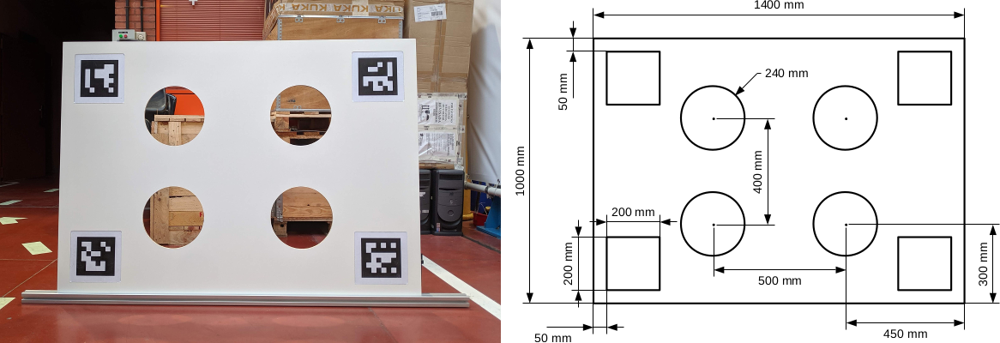

# velo2cam_stereoHough
This fork uses a different approach in the calculation of the centered points of the stereo camera, using the hough trasformation to find the circle in the camera.

# velo2cam_calibration [](https://build.ros.org/view/Ndev/job/Ndev__velo2cam_calibration__ubuntu_focal_amd64/)

The *velo2cam_calibration* software implements a state-of-the-art automatic calibration algorithm for pair of sensors composed of LiDAR and camera devices in any possible combination, as described in this paper: 

**Automatic Extrinsic Calibration Method for LiDAR and Camera Sensor Setups**  
[Jorge Beltrán](https://beltransen.github.io/), [Carlos Guindel](https://cguindel.github.io/), Arturo de la Escalera, Fernando García  
IEEE Transactions on Intelligent Transportation Systems, 2022  
**\[[Paper](https://ieeexplore.ieee.org/abstract/document/9733276)\] \[[Preprint](https://arxiv.org/abs/2101.04431)\]**


## Setup ##
This software is provided as a ROS package. To install:
1. Clone the repository into your *catkin_ws/src/* folder.
2. Install run dependencies: ```sudo apt-get install ros-<distro>-opencv-apps```
3. Build your workspace [as usual](http://wiki.ros.org/ROS/Tutorials/BuildingPackages).

## Usage ##
See [HOWTO.md](HOWTO.md) for detailed instructions on how to use this software.

To test the algorithm in a virtual environment, you can launch any of the calibration scenarios included in our [Gazebo validation suite](https://github.com/beltransen/velo2cam_gazebo).

## Calibration target ##
The following picture shows a possible embodiment of the proposed calibration target used by this algorithm and its corresponding dimensional drawing.



**Note:** Other size may be used for convenience. If so, please configure node parameters accordingly.

## Citation ##
If you use this work in your research, please consider citing the following paper:

```
@article{beltran2022,  
  author={Beltrán, Jorge and Guindel, Carlos and de la Escalera, Arturo and García, Fernando},  
  journal={IEEE Transactions on Intelligent Transportation Systems},   
  title={Automatic Extrinsic Calibration Method for LiDAR and Camera Sensor Setups},   
  year={2022}, 
  doi={10.1109/TITS.2022.3155228}
}
```

A previous version of this tool is available [here](https://github.com/beltransen/velo2cam_calibration/tree/v1.0) and was described on this [paper](https://doi.org/10.1109/ITSC.2017.8317829). 
